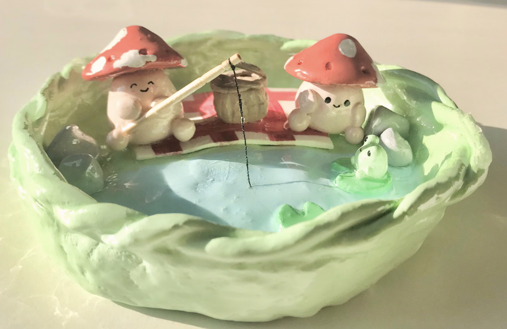

# PondSketch Project

## Overview

"It is a quiet afternoon and 2 mushroom-chibis are sitting by a serene pond, having a picnic, surrounded by lush greenery. One mushroom-chibi, with a gentle smile, is holding a fishing rod, patiently waiting for a catch. Beside it, the ssecond mushroom-chibi looks on with wide-eyed curiosity, and decides whether the catch is worthy of their picnic or not. The scene exudes a sense of tranquility and whimsy, inviting one to pause and appreciate simple joys."

This project is an interactive drawing experience built with p5.js, centered around the serene pond scene described above.

The goal was to create a visually engaging and relaxing environment that encourages creativity and experimentation, with a "game" element of fishing for emojies in which the user must draw the emoji accuratley enough, or, if the user prefers, simple drawing on the pond surface to create a serene scene.

## Functionality

This project has 2 main modes:

1. **Drawing Mode**: Users can draw freely on the pond surface using a brush tool. The drawing experience is designed to be smooth and intuitive, but fairly simple. There is only the hard-coded limited color pallete, singular brush size, and an eraser tool. Once the user is satisfied with their drawing, they can click the "save image" button to finish their session and save their artwork as an image file with the current timestamp as the filename.

2. **Game Mode**: In this mode, users are prompted to "fish" for a specific emoji by drawing it on the pond surface. The target emoji is displayed in the thought bubble of the rightmost mushroom-chibi and users must replicate it as closely as possible using the drawing tools. Once they finish their drawing and click "done", the system evaluates their drawing against the target emoji using a pixel-based comparison method (Dice score) and then decides whether the mushroom-chibis keep or release the caught emoji based on the accuracy of the drawing. Feedback is provided through changes in the facial expressions of the rightmost mushroom-chibi.

## Design Principles

The design focuses on being simple, calm, and a little playful. The color palette uses soft greens and blues to make the pond feel like the center of the scene, while a few brighter accents draw attention to buttons and tools. Everything is arranged to feel balanced without crowding the space. The controls stay minimal and visual so people can figure things out just by trying them. The goal was to make a drawing tool that feels easy to explore rather than something that needs instructions.

Due to the setup of the project, the user is mostly encouraged to make simplistic line drawings, that, in the game mode, capture the essence of the target emoji rather than a more detailed or complex artwork. There is no "bucket" tool or "fill" tool, and the brush size cannot be altered, so the user must rely on line work to suggest shapes and forms. Thus the user is constrained somewhat in their artistic expression, which was an intentional design choice to fit the requirements of this project, and with the added benefit of fitting the calm and simple aesthetic of the overall scene.

Instead of checking what someone draws using perfect vector lines, the project looks at the actual pixels. When a player finishes, both their drawing and the target emoji are turned into small black and white masks and compared using a Dice score to see how closely they match. Working in bitmap space lets the program see the full picture, including messy strokes and softer edges, which makes the evaluation feel more natural and forgiving. It turns a simple technical test into something that feels more like a creative conversation between the player and the system.

## Development Process

This was inspired my an air-dry clay project I was doing with a friend last week, in which we tried to make a whimsical jewelry plate integrating frogs and mushrooms.

**Original inspiration used for the clay project:**

**Our final air-dry clay project:**

This previous work helped me visualize the kind of setting I wanted this project to have and helped me narrow down the kind of interaction I wanted the user to have. In order to maintain the "scene" I decided to proceed with, there were limited ways in which I could think of the user interacting with it.

Thus, I first spent a considerable amount of time working with p5.js to create the pond scene, including the mushroom-chibis, the pond, and the surrounding environment. I focused on getting the colors and composition right to evoke the calm and whimsical atmosphere I was going for. Initially I struggled with some of the drawing mechanics, particularly with getting rid of specific elements of the outline of the pond and the "shelf" which the mushrooms are sitting on.

Next, I decided to allow the user to only draw on the largest available surface within the image - the pond surface. This was done by creating a mask based on the pond shape and only allowing drawing within that area. I implemented a simple brush tool with a limited color palette to keep the drawing experience straightforward and focused.

I had a vague idea of some way to make this into a drawing game from the very beginning, but once the initial setup was done I was able to iterate on that and expand what I am looking for. Initially, I thought about simply having the user draw a fish, but decided it would then only be a "one and done" experience. Thus, I decided to have the user "fish" for various emojis, which would allow for a more varied and replayable experience. The hardest part in this was figuring out how to evaluate the user's drawing in a way that felt fair and intuitive. After some research, I settled on using a pixel-based comparison method (Dice score) which allowed for a more forgiving evaluation that could account for the imperfections in hand-drawn art.

Finally, I added UI elements to switch between drawing mode and game mode, as well as buttons to save the artwork and submit drawings in game mode. I added this because I was thinking that someone might just want to make simple linework for fun in order to lean more into the "serene" scene.
